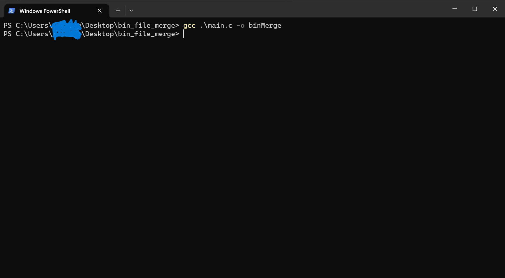
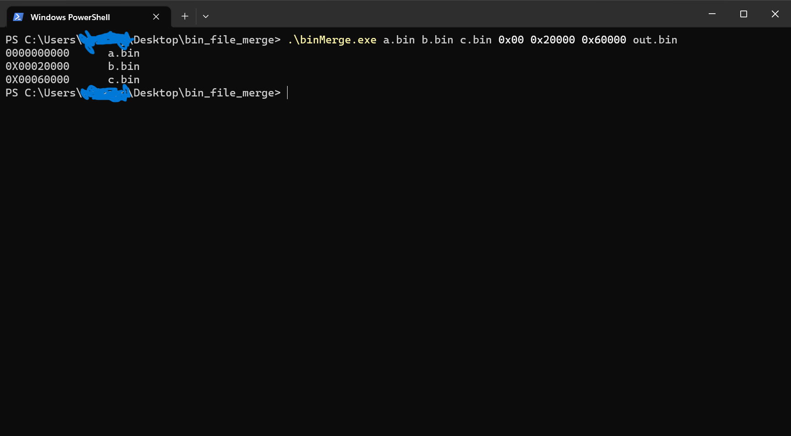
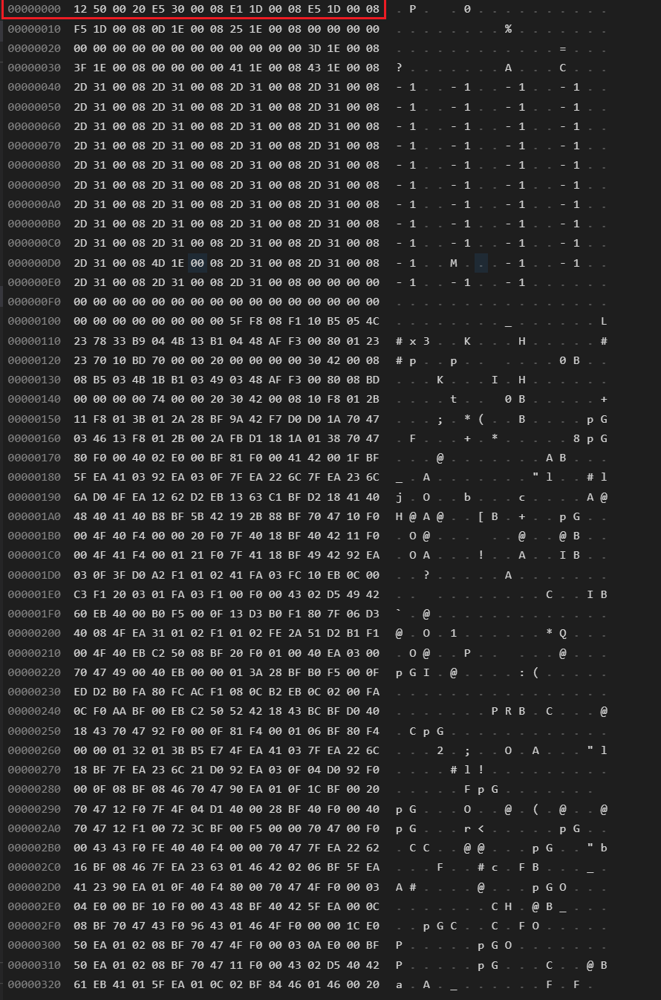
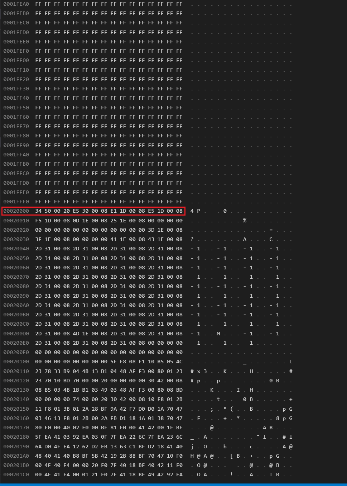
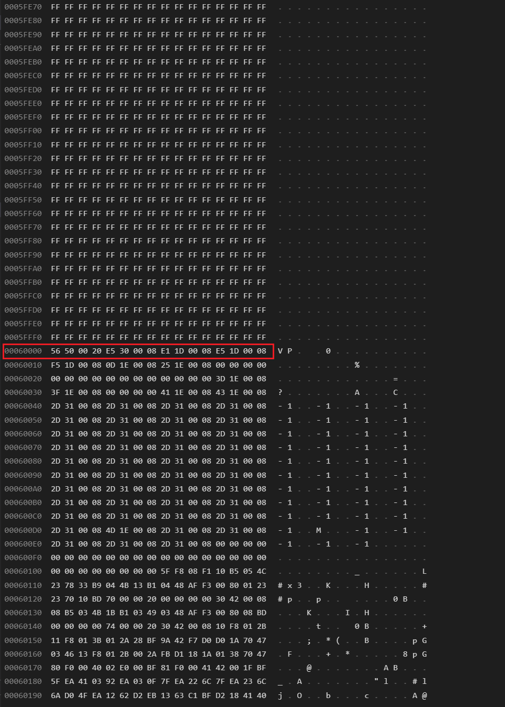

<!-- /TOC -->
- [binMerge](#binmerge)
			- [介绍](#介绍)
			- [代码编译](#代码编译)
			- [使用说明](#使用说明)
			- [使用效果](#使用效果)

# binMerge

#### 介绍
在单片机的开发过程中，经常需要将多个单独的bin文件合并成一个文件，方便烧写和生产。这是一个命令行工具，可以实现多个二进制bin文件的合并，任一指定偏移量合并。使用它可以直接将编译好的多个bin文件按照程序员需要合并，而不需费力去重建工程重新编译。有兴趣的朋友可以试试。


#### 代码编译

```
gcc main.c -o binMerge
```
[](https://gitee.com/WeiKangYang/bin-merge)
#### 使用说明

1. 在binMerge.exe所在文件夹中打开cmd或powershell 
2. 合并bin文件时需要为每个bin文件指定偏移地址,最后需要指定输出的文件名。
```
.\binMerge.exe a.bin b.bin c.bin 0x00 0x20000 0x60000 out.bin
```
程序的最后会输出每个文件的偏移地址
```
0000000000      a.bin
0X00020000      b.bin
0X00060000      c.bin
```
[](https://gitee.com/WeiKangYang/bin-merge)
3. 有的人可能希望两个bin文件之间填充0x00而不是0xff，可以修改此处宏定义。
   
main.c
```c
#define FILL    (uint8_t)0xff   /*填充字符*/
```
#### 使用效果
打开out.bin可以看到，地址0x00处的固件为a.bin,地址0x20000处的固件为b.bin,地址0x60000处的固件为c.bin
[](https://gitee.com/WeiKangYang/bin-merge)
[](https://gitee.com/WeiKangYang/bin-merge)
[](https://gitee.com/WeiKangYang/bin-merge)